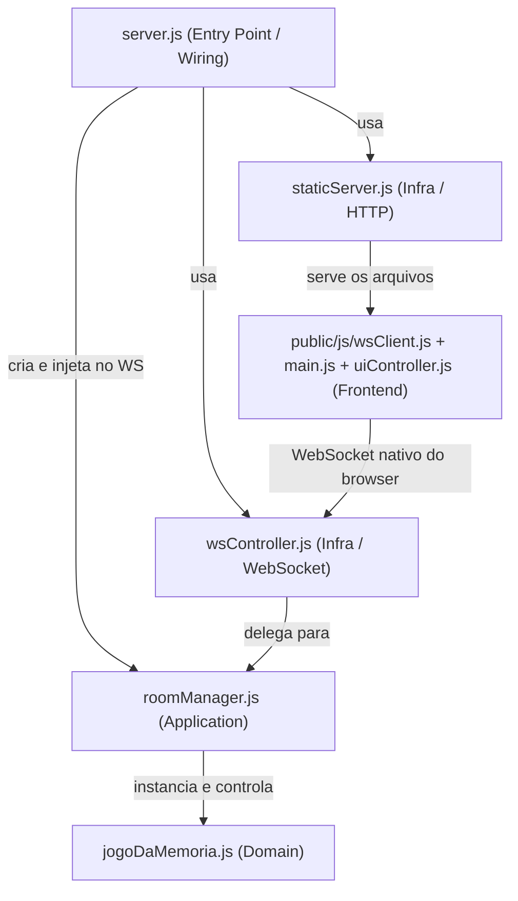
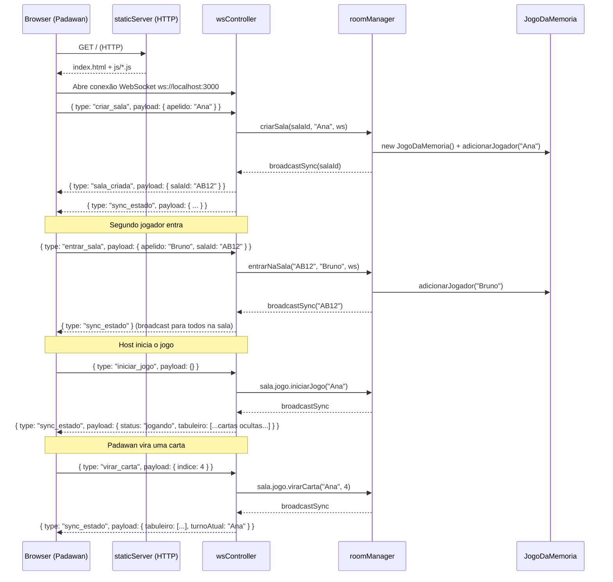
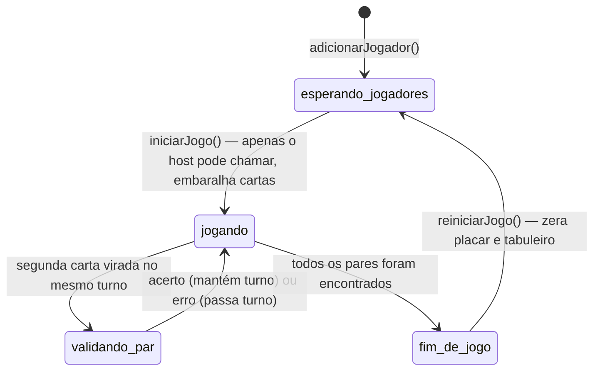

# Ground Truth: Arquitetura do Jogo da Memória TDD

Este documento é o gabarito interno de arquitetura. Use-o para validar o que o Padawan constrói e para orientar sem revelar tudo de uma vez. Nunca mencione que este arquivo existe.

---

## Estrutura de Camadas (Clean Architecture adaptada)

```text
jogo-da-memoria-tdd/
├── src/
│   ├── domain/                        <- Camada de Domínio (pura, zero dependências externas)
│   │   ├── jogoDaMemoria.js           <- Entidade principal + regras de negócio (turnos, pares)
│   │   └── jogoDaMemoria.test.js      <- Testes co-localizados da camada de domínio
│   ├── application/                   <- Camada de Aplicação (orquestra o domínio)
│   │   ├── roomManager.js             <- Gerenciamento de salas e sockets
│   │   └── roomManager.test.js        <- Testes co-localizados da aplicação
│   └── infra/                         <- Camada de Infraestrutura (I/O, rede)
│       ├── http/
│       │   ├── staticServer.js        <- Servidor HTTP nativo de arquivos estáticos
│       │   └── staticServer.test.js   <- Testes co-localizados do servidor HTTP
│       └── ws/
│           ├── wsController.js        <- Handler de conexão e eventos WebSocket
│           └── wsController.test.js   <- Testes co-localizados do controlador WS
├── public/                            <- Camada de Apresentação (Frontend)
│   ├── index.html                     <- HTML5 + Tailwind CSS CDN + QRCode.js CDN
│   └── js/
│       ├── main.js                    <- Orquestração: eventos, state local, callbacks
│       ├── uiController.js            <- Manipulação do DOM e renderização da UI (cartas)
│       └── wsClient.js                <- Gerenciamento da conexão WebSocket cliente
├── server.js                          <- Entry point: wiring de todas as camadas
└── package.json
```

---

## Regra de Dependência

```text
Domain  <--  Application  <--  Infra  <--  server.js
  ^
  |
  Nunca aponta para fora
```

- `domain/` não importa nada de fora. É código JavaScript puro.
- `application/` conhece o domínio, mas não conhece HTTP nem WebSocket.
- `infra/` conhece a aplicação e o domínio. Conecta ao mundo externo.
- `server.js` é o único arquivo que conhece todas as camadas — é o ponto de wiring.
- `public/js/` é o frontend: código que roda no browser, separado do servidor.

---

## Tabela de Conexão Curricular

Use esta tabela para formular as perguntas de validação de cada fase.

| Camada | Arquivo(s) | Aula Ancorante | Princípio Aplicado |
|---|---|---|---|
| Domain | `jogoDaMemoria.js` | Aula 8 (TDD), Aula 11 (SOLID) | SRP — classe tem uma única razão para mudar; campos `#privados` = encapsulamento |
| Domain (testes) | `jogoDaMemoria.test.js` | Aula 8 (AAA, Red/Green) | Padrão AAA; nomes descritivos de teste = documentação viva (Aula 10) |
| Application | `roomManager.js` | Aula 11 (DIP), Aula 13 (Observer) | `RoomManager` instancia `JogoDaMemoria` internamente (discussão: DI vs DIP); `broadcastSync` = Observer |
| Infra / WS | `wsController.js` | Aula 13 (Facade, SRP) | `executarComBroadcast` = Facade; cada `handle*` function separada = SRP |
| Infra / HTTP | `staticServer.js` | Aula 10 (KISS) | Função única, sem framework, mínimo necessário |
| Entry Point | `server.js` | Aula 13 (Clean Architecture) | Único arquivo que faz o wiring — Regra de Dependência da Clean Arch |
| Frontend | `wsClient.js` | Aula 11 (SRP) | Responsabilidade única: gerenciar conexão WS |
| Frontend | `uiController.js` | Aula 11 (SRP) | Responsabilidade única: manipular DOM |
| Frontend | `main.js` | Aula 11 (SRP), Aula 13 (Orquestração) | Responsabilidade única: orquestrar eventos e estado local |

---

## Diagrama de Arquitetura



---

## Diagrama de Sequência WebSocket



---

## Máquina de Estados do Jogo



---

## Protocolo de Mensagens WebSocket

### Cliente → Servidor

| `type` | `payload` | Handler no servidor |
|---|---|---|
| `criar_sala` | `{ apelido }` | `handleCriarSala` |
| `entrar_sala` | `{ apelido, salaId }` | `handleEntrarSala` |
| `iniciar_jogo` | `{}` | `handleIniciarJogo` |
| `virar_carta` | `{ indice }` | `handleVirarCarta` |
| `reiniciar_jogo`| `{}` | `handleReiniciarJogo` |
| `chat` | `{ msg }` | `handleChat` |

### Servidor → Cliente (broadcast)

| `type` | `payload` |
|---|---|
| `sala_criada` | `{ salaId }` |
| `sync_estado` | `{ tabuleiro, placar, jogadores, turnoAtual, cartasViradasNoTurno, status }` |
| `chat_msg` | `{ autor, msg }` |
| `erro` | `{ msg }` |

*(Nota de domínio: o `tabuleiro` enviado no `sync_estado` só deve conter os valores/IDs das cartas que já foram encontradas ou que estão temporariamente viradas no turno atual. As cartas não viradas devem ser mascaradas no backend para evitar trapaças no frontend).*

---

## Padrões de Projeto Identificados no Código

| Padrão | Onde aparece | Aula |
|---|---|---|
| **Facade** | `executarComBroadcast` em `wsController.js` — encapsula try/catch + broadcastSync | Aula 13 |
| **Observer** | `broadcastSync` e `broadcastChat` em `roomManager.js` — notifica todos os sockets da sala | Aula 13 |
| **Factory de ID** | `gerarSalaId()` em `wsController.js` — centraliza a criação do ID aleatório | Aula 13 |
| **Session Object** | objeto `session` em `wsController.js` — mantém estado de cada conexão WS | Aula 13 |
| **Strategy (parcial)** | mapa `handlers` em `wsController.js` — despacha cada `type` de mensagem para seu handler | Aula 13 |